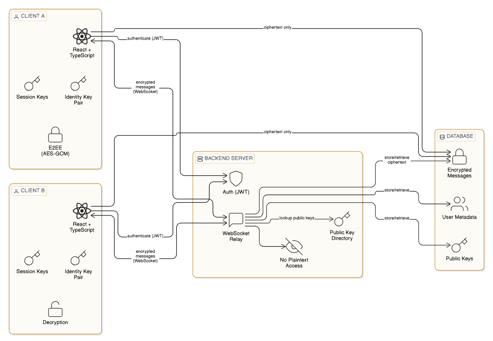

# Chit-Chat
## Secure Real-Time Communication System (E2EE)
### Overview
This project is a secure real-time communication system designed to explore end-to-end encryption, key management, and cloud deployment in a realistic full-stack environment. The primary goal is to ensure message confidentiality even if the backend infrastructure is compromised.

The system uses client-side encryption with modern cryptographic primitives and a WebSocket-based backend that acts only as a message relay.

### Architecture

  

**Figure:** End-to-end encrypted real-time messaging architecture where the backend acts only as a relay and ciphertext storage layer.

- Frontend: React + TypeScript
- Backend: Node.js (WebSocket + REST)
- Database: PostgreSQL / MongoDB
- Cloud: AWS (EC2 / ECS, ALB, IAM)
- CI/CD: GitHub Actions

All cryptographic operations are performed on the client. The server never has access to plaintext messages or private keys.

### Security Design

#### Threat Model

**Assumed threats**
- Compromised server or database
- Network interception
- Unauthorized read access to stored messages

**Out of scope**
- Compromised client devices
- Malware/keylogging
- Social engineering

**End-to-End Encryption**
- Each client generates a long-term identity key pair locally
- Session keys are derived using X25519 and HKDF
- Messages are encrypted using AES-256-GCM
- Only the ciphertext is transmitted and stored

**Key Management**
- Private keys never leave the client
- Session keys are ephemeral
- Server stores only public keys and encrypted payloads
- Compromise of one session does not affect others

**Tradeoffs & Limitations**
- Metadata (timestamps, routing info) is visible to the server
- No content moderation due to E2EE
- Client compromise is not mitigated
- These tradeoffs were accepted to prioritize confidentiality and system simplicity.

#### **Motivation**
This project was built to better understand how secure communication systems operate in practice, beyond theoretical cryptography—focusing on real-world constraints such as deployment, reliability, and system boundaries.
